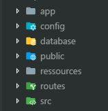
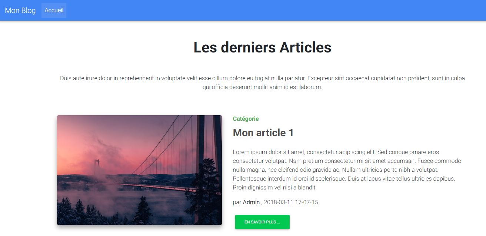

# Cocoon-projet/di Application de démonstration

Réalisation d'un mini framework mvc avec l'utilisation de classe Facade (View, Route et DI) " inspiration Laravel "

### Librairies utilisées pour le fonctionnement

[zendframework/zend-diactoros](https://github.com/zendframework/zend-diactoros) PSR-7 http message

[league/plates](https://github.com/thephpleague/plates) Système de template php natif

[nikic/fast-route](https://github.com/nikic/FastRoute) Router pour php

[cocoon-projet/di](https://github.com/cocoon-projet/di) Conteneur d'injection de dépendances

[mdbootstrap](https://mdbootstrap.com/) Framework Html basé sur bootstrap

# Architecture



* **app**: pour les controlleurs et les "models" (**Autowiring** au niveau des controlleurs (constructeur et méthodes))
* **config**: contient le fichier pour enregistrer les services
* **database**: pour la base de donnée de l'application
* **public**: point d'entrée de l'application avec le fichier index.php
* **ressources**: contient les vues de l'application
* **routes**: contient les routes de l'application dans le fichier web.php
* **src**: contient les fichiers de fonctionnement de l'application

## Démarrer l'application

> Pour démarrer l'application lancer votre Terminal cloner le dépot, rendez vous dans le dossier di-app-demo et faite un composer install 

```
git clone https://github.com/cocoon-projet/di-app-demo.git
cd di-app-demo
composer install
```

Vous pouvez lancer l'application avec le serveur php interne

```
php -S 0.0.0.0:8000 -t public/
```

Aller sur votre navigateur et lancer l'adresse suivante [http://localhost:8000](http://localhost:8000).

## Screenshot de l'application



> Note: Ne pas utiliser en production


